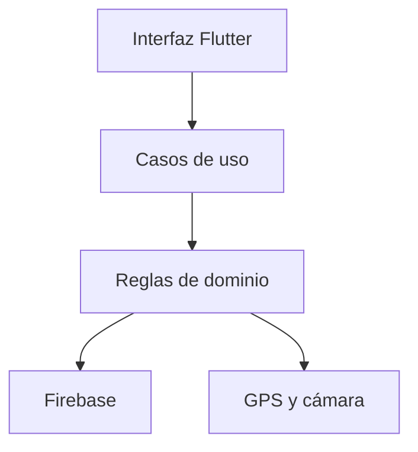

# Control de Asistencia

Aplicación móvil desarrollada con Flutter y Firebase para registrar la entrada y salida de trabajadores mediante autenticación, validación geográfica y evidencia fotográfica.

## Problema

El registro manual de asistencia puede presentar suplantaciones, duplicidad, información incompleta y dificultad para comprobar si el trabajador se encontraba realmente en la sede autorizada.

Este proyecto propone un MVP que registra cada jornada con:

- Usuario autenticado.
- Perfil activo y sede asignada.
- Ubicación GPS precisa.
- Validación del radio geográfico.
- Detección de ubicaciones simuladas.
- Evidencia fotográfica.
- Fecha y hora del servidor.
- Control transaccional de entrada y salida.

## Usuarios

### Trabajador

Puede:

- Iniciar y cerrar sesión.
- Consultar su perfil y sede.
- Validar su ubicación.
- Registrar una entrada diaria.
- Registrar una salida.
- Consultar sus propias asistencias.

### Administrador

Puede:

- Consultar, buscar, registrar y actualizar perfiles.
- Crear cuentas de Authentication sin cerrar su propia sesión.
- Activar o desactivar trabajadores.
- Asignar sedes y roles.
- Crear, actualizar o desactivar sedes.
- Consultar las asistencias recientes y sus evidencias fotográficas.

Estas operaciones se realizan desde un panel móvil exclusivo para el rol
`admin` y también están protegidas mediante reglas de seguridad.

## Alcance del MVP

El MVP implementa:

- Inicio de sesión con Firebase Authentication.
- Autorización mediante perfiles almacenados en Firestore.
- Roles `admin` y `employee`.
- Estados `active`, `inactive` y `pending`.
- Asignación de una sede por trabajador.
- Consulta de la configuración geográfica de la sede.
- Obtención de ubicación GPS precisa.
- Cálculo de distancia mediante la fórmula de Haversine.
- Rechazo de ubicaciones simuladas.
- Captura de fotografía con la cámara frontal.
- Validación de archivo JPEG de hasta 2 MB.
- Registro transaccional de entrada y salida.
- Prevención de registros duplicados.
- Consulta limitada del historial propio.
- Recuperación de contraseña por correo.
- Panel administrativo con resumen operativo.
- Gestión de trabajadores y sedes.
- Consulta global de asistencias y evidencias.
- Reglas de seguridad para Firestore y Cloud Storage.
- Pruebas unitarias, de widgets y de reglas con emuladores.

No incluye planillas, permisos laborales, reconocimiento facial, cálculo de remuneraciones ni múltiples turnos.

## Plataformas verificadas

| Plataforma | Validación realizada | Resultado |
|---|---|---|
| Android | Análisis, pruebas, APK release y flujo funcional en dispositivo/emulador | Aprobado |
| iOS | Análisis, pruebas, compilación con Xcode 26.5, instalación y arranque en simulador iPhone | Aprobado |

La validación automatizada de iOS se ejecutó mediante GitHub Actions en
macOS 26 con Flutter 3.44.4. La aplicación permaneció abierta y generó la
captura [`12-ios-launch.png`](docs/evidencias/12-ios-launch.png).

La cámara y el GPS reales de iOS requieren una comprobación final en un
iPhone físico antes de publicar en App Store.
## Sede configurada

| Campo | Valor |
|---|---|
| Identificador | `unh-pampas` |
| Nombre | UNH sede Pampas |
| Dirección | Av. Perú, Daniel Hernández 09161 |
| Latitud | `-12.389037` |
| Longitud | `-74.858949` |
| Radio permitido | 100 metros |
| Precisión máxima | 30 metros |
| Zona horaria | `America/Lima` |

## Arquitectura

El proyecto separa responsabilidades en cuatro capas:

- `presentation`: pantallas, tarjetas y puertas de acceso.
- `application`: coordinación del registro de asistencia.
- `domain`: entidades, contratos y reglas de negocio.
- `data`: implementaciones con Firebase, Geolocator e Image Picker.

## Documentación

- [Contexto, alcance y diagnóstico de datos](docs/01-contexto-y-diagnostico.md)
- [Modelo y diccionario de datos](docs/02-modelo-y-diccionario.md)
- [Matriz pantalla–dato–consulta](docs/03-matriz-pantalla-dato-consulta.md)
- [Consultas, CRUD, pruebas y defensa](docs/04-pruebas-y-defensa.md)
- [Trazabilidad final de la rúbrica](docs/05-trazabilidad-rubrica.md)

## Evidencias de evaluación

Las capturas, resultados de pruebas e historial del desarrollo están disponibles en la carpeta [`docs/evidencias`](docs/evidencias).
