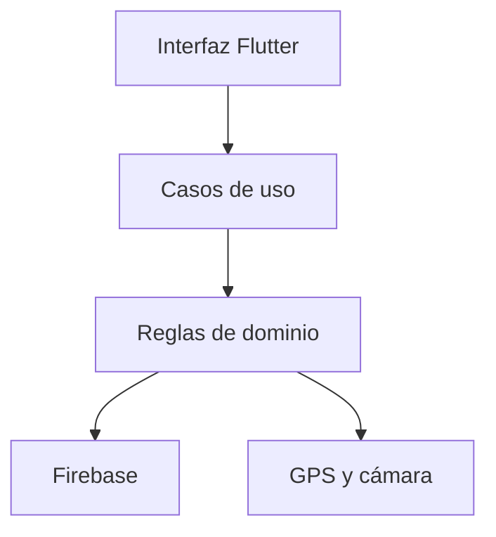

# Sistema de Asistencia Hospitalaria

Aplicación móvil desarrollada con Flutter, Firebase y Cloudinary para registrar
la entrada y salida de trabajadores de un hospital mediante autenticación, validación
geográfica, verificación facial y evidencia fotográfica.

## Problema

El registro manual de asistencia puede presentar suplantaciones, duplicidad, información incompleta y dificultad para comprobar si el trabajador se encontraba realmente en la sede autorizada.

Este proyecto propone un MVP que registra cada jornada con:

- Usuario autenticado.
- Perfil activo, sede, área hospitalaria, cargo y turno asignados.
- Ubicación GPS precisa.
- Validación del radio geográfico.
- Detección de ubicaciones simuladas.
- Evidencia fotográfica almacenada fuera de Firestore.
- Comparación facial local contra una plantilla matriculada por administración.
- Constancia digital por cada entrada y salida.
- Fecha y hora del servidor.
- Control transaccional de entrada y salida.

## Usuarios

### Trabajador

Puede:

- Iniciar y cerrar sesión.
- Consultar su perfil, sede, área hospitalaria, cargo y turno.
- Validar su ubicación.
- Registrar una entrada diaria.
- Registrar una salida.
- Consultar sus propias asistencias.

### Administrador

Puede:

- Consultar, buscar, registrar y actualizar perfiles.
- Crear cuentas de Authentication sin cerrar su propia sesión.
- Activar o desactivar trabajadores.
- Asignar sedes, roles, áreas hospitalarias, cargos y turnos.
- Crear, actualizar o desactivar sedes.
- Consultar las asistencias recientes y sus evidencias fotográficas.
- Matricular o reemplazar el rostro de un trabajador con consentimiento.

Estas operaciones se realizan desde un panel móvil exclusivo para el rol
`admin` y también están protegidas mediante reglas de seguridad.

## Alcance del MVP

El MVP implementa:

- Inicio de sesión con Firebase Authentication.
- Autorización mediante perfiles almacenados en Firestore.
- Roles `admin` y `employee`.
- Estados `active`, `inactive` y `pending`.
- Asignación de una sede por trabajador.
- Asignación de área hospitalaria y cargo por trabajador.
- Turnos de mañana, tarde, noche y guardia de 24 horas.
- Jornada nocturna continua: la salida de madrugada se vincula al día en que
  comenzó el turno.
- Consulta de la configuración geográfica de la sede.
- Obtención de ubicación GPS precisa.
- Cálculo de distancia mediante la fórmula de Haversine.
- Rechazo de ubicaciones simuladas.
- Captura de fotografía con la cámara frontal.
- Cámara integrada con vista previa, repetición y confirmación, sin abandonar
  la aplicación ni permitir imágenes antiguas de la galería.
- Detección local con ML Kit: exige exactamente un rostro, centrado, cercano y
  mirando de frente antes de subir la evidencia.
- Verificación facial local mediante un vector biométrico de 192 valores y
  similitud mínima de 0.60 antes de permitir la entrada o salida.
- Prueba de vida activa en dos pasos: fotografía frontal y desafío aleatorio
  de giro o inclinación de cabeza, validado por diferencia de pose.
- Validación de archivo JPEG de hasta 2 MB.
- Carga de evidencia en Cloudinary y almacenamiento de la URL en Firestore.
- Constancia de asistencia con número y código de verificación.
- Aceptación expresa del aviso de privacidad antes de cada marcación.
- Finalidad y fecha límite de conservación registradas junto a cada evidencia.
- Aviso de privacidad consultable desde la pantalla principal.
- Registro transaccional de entrada y salida.
- Prevención de registros duplicados.
- Consulta limitada del historial propio.
- Recuperación de contraseña por correo.
- Panel administrativo con resumen operativo.
- Gestión de trabajadores y sedes.
- Consulta global de asistencias y evidencias.
- Reglas de seguridad para asistencias y plantillas faciales en Firestore.
- Pruebas unitarias, de widgets y de reglas con emuladores.

No incluye una solución certificada de presentación de ataques biométricos,
planillas, permisos laborales ni cálculo de remuneraciones. Los turnos son
asignaciones fijas del MVP; no incluye rotaciones automáticas ni programación
mensual de guardias.
La prueba de vida implementada reduce el uso de una fotografía estática, pero
no reemplaza una certificación biométrica especializada. La constancia de
asistencia no es una
boleta de venta, no representa una operación comercial y no genera impuestos.

## Configuración de Cloudinary

La aplicación no contiene el `API secret` de Cloudinary. Para una ejecución de
desarrollo se deben proporcionar únicamente el nombre del cloud y un preset de
carga restringido:

```powershell
flutter run `
  --dart-define=CLOUDINARY_CLOUD_NAME=SU_CLOUD `
  --dart-define=CLOUDINARY_UNSIGNED_UPLOAD_PRESET=SU_PRESET
```

El preset debe limitar formato, tamaño, carpeta y tipo de recurso. Para una
publicación real se requiere un backend que firme cargas y accesos; una clave
administrativa nunca debe incorporarse al APK.

## Protección de información

- Firestore no almacena los bytes de la fotografía, solo su referencia.
- La plantilla facial es un dato biométrico sensible: solo el administrador
  puede crearla o sustituirla y el trabajador únicamente puede leer la propia.
- Las contraseñas son gestionadas por Firebase Authentication.
- No se registran DNI, información financiera ni datos tributarios.
- La constancia enmascara el nombre del trabajador.
- Las capturas de demostración deben utilizar perfiles ficticios.
- Cada evidencia nueva registra una conservación programada de 90 días.
- La eliminación al vencer el plazo requiere un proceso administrativo o
  backend autorizado; el secreto de Cloudinary nunca se incorpora al APK.
- La fotografía, la plantilla facial y la ubicación son datos sensibles o de
  especial protección. No se presentan como datos anónimos ni se reutilizan
  para una finalidad distinta al control de asistencia.

## Estado por plataforma

| Plataforma | Validación realizada | Estado |
|---|---|---|
| Android | Análisis, pruebas, APK release y flujo funcional en dispositivo/emulador | Aprobado |
| iOS | Proyecto, Firebase, permisos, CocoaPods y dependencias preparados para iOS 15.5 o posterior | Preparado; revalidación pendiente en macOS |

Existe una validación histórica de una versión anterior mediante GitHub
Actions. No se presenta como prueba de la versión 1.7.0 porque las dependencias
biométricas cambiaron posteriormente. El workflow actual
`.github/workflows/ios-build.yml` permite repetir la compilación, instalación y
arranque en un simulador iPhone sobre macOS.

La versión 1.7.0 requiere una ejecución satisfactoria del workflow actual y una
comprobación de cámara, GPS, reconocimiento facial y prueba de vida en un
iPhone físico antes de declararse validada o publicarse en App Store.
## Sede configurada

| Campo | Valor |
|---|---|
| Identificador | `unh-pampas` |
| Nombre | UNH sede Pampas |
| Dirección | Av. Perú, Daniel Hernández 09161 |
| Latitud | `-12.389037` |
| Longitud | `-74.858949` |
| Radio permitido | 100 metros |
| Precisión máxima | 30 metros |
| Zona horaria | `America/Lima` |

## Arquitectura

El proyecto separa responsabilidades en cuatro capas:

- `presentation`: pantallas, tarjetas y puertas de acceso.
- `application`: coordinación del registro de asistencia.
- `domain`: entidades, contratos y reglas de negocio.
- `data`: implementaciones con Firebase, Geolocator e Image Picker.



## Documentación

- [Contexto, alcance y diagnóstico de datos](docs/01-contexto-y-diagnostico.md)
- [Modelo y diccionario de datos](docs/02-modelo-y-diccionario.md)
- [Matriz pantalla–dato–consulta](docs/03-matriz-pantalla-dato-consulta.md)
- [Consultas, CRUD, pruebas y defensa](docs/04-pruebas-y-defensa.md)
- [Trazabilidad final de la rúbrica](docs/05-trazabilidad-rubrica.md)
- [Política de privacidad y conservación](docs/06-politica-privacidad-retencion.md)
- [Preparación y validación de iOS](docs/07-compatibilidad-ios.md)

## Evidencias de evaluación

Las capturas, resultados de pruebas e historial del desarrollo están disponibles en la carpeta [`docs/evidencias`](docs/evidencias).
