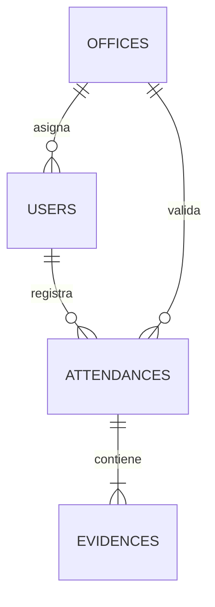
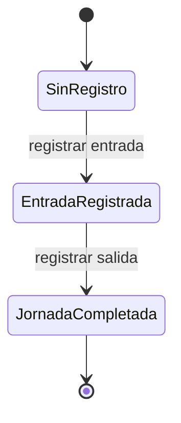

# Modelo y diccionario de datos

## 1. Propósito del modelo

El modelo permite registrar una jornada diaria por trabajador y conservar la relación entre:

- Usuario autenticado.
- Perfil autorizado.
- Sede asignada.
- Ubicación de entrada y salida.
- Evidencia fotográfica.
- Estado de la jornada.
- Fechas de captura y confirmación.

La solución distribuye la información entre:

| Servicio | Información almacenada |
|---|---|
| Firebase Authentication | Identidad, correo, contraseña y sesión |
| Cloud Firestore | Usuarios, sedes, plantillas faciales y asistencias |
| Cloudinary | Evidencias fotográficas JPEG |

## 2. Colecciones y relaciones



Aunque Firestore es una base documental, existen relaciones lógicas mediante los campos `uid`, `userId` y `officeId`.

## 3. Estructura general

```text
users/{uid}
offices/{officeId}
attendances/{uid}_{YYYY-MM-DD}
faceProfiles/{uid}
Cloudinary/image/upload/{identificador}.jpg
```

## 4. Decisiones de diseño

### 4.1. Una asistencia por jornada

La entrada y salida se almacenan dentro de un mismo documento. Esto evita fragmentar una jornada en documentos independientes.

El identificador se construye así:

```text
{uid}_{YYYY-MM-DD}
```

Ejemplo:

```text
employee-001_2026-07-30
```

Este diseño permite:

- Consultar directamente la jornada actual.
- Prevenir entradas duplicadas.
- Aplicar idempotencia.
- Validar la propiedad desde el ID.
- Actualizar la salida mediante una transacción.
- Evitar una consulta previa para descubrir el documento.

### 4.2. Entrada y salida como mapas

Los campos `checkIn` y `checkOut` agrupan los datos de cada marcación:

- Hora capturada.
- Hora del servidor.
- Ubicación.
- Precisión.
- Distancia.
- Indicador de GPS simulado.
- URL HTTPS de evidencia.
- Verificación facial y prueba de vida.
- Consentimiento, finalidad y fecha de conservación.

Esto mantiene la jornada como una sola unidad transaccional.

### 4.3. Referencias mediante identificadores

El modelo usa identificadores de texto en vez de referencias Firestore:

- `userId`
- `officeId`

Esta decisión simplifica:

- Reglas de seguridad.
- Consultas por igualdad.
- Serialización a objetos Dart.
- Pruebas con emuladores.
- Migración o exportación de datos.

### 4.4. Evidencia fuera de Firestore

Firestore almacena únicamente `evidencePath`. El archivo JPEG se guarda en
Cloudinary. La aplicación valida que la referencia use HTTPS, el dominio
`res.cloudinary.com`, el tipo de recurso `image/upload` y la extensión JPEG.
El APK contiene solo el nombre del cloud y un preset restringido; nunca contiene
el API secret.

### 4.5. Versión de esquema

Todas las colecciones incluyen:

```text
schemaVersion: 1
```

Este campo permite detectar documentos incompatibles y preparar migraciones futuras.

## 5. Estados de una jornada



| Estado Firestore | Significado | `checkOut` |
|---|---|---|
| Documento inexistente | Todavía no se registró entrada | No aplica |
| `checked-in` | Entrada confirmada | `null` |
| `completed` | Entrada y salida confirmadas | Mapa obligatorio |

No se permite regresar de `completed` a `checked-in`.

# 6. Diccionario de la colección `users`

Ruta:

```text
users/{uid}
```

| Campo | Tipo Firestore | Obligatorio | Nulo | Restricciones |
|---|---|---:|---:|---|
| `uid` | `string` | Sí | No | Debe coincidir con el ID del documento |
| `email` | `string` | Sí | No | Entre 4 y 254 caracteres |
| `fullName` | `string` | Sí | No | Entre 3 y 100 caracteres |
| `employeeCode` | `string` | Sí | No | Entre 3 y 30 caracteres |
| `role` | `string` | Sí | No | `admin` o `employee` |
| `status` | `string` | Sí | No | `active`, `inactive` o `pending` |
| `officeId` | `string` o `null` | Sí | Sí | Entre 3 y 50 caracteres cuando existe |
| `schemaVersion` | `integer` | Sí | No | Valor exacto `1` |
| `createdAt` | `timestamp` | Sí | No | Hora del servidor al crear |
| `updatedAt` | `timestamp` | Sí | No | Hora del servidor al crear o modificar |

## 6.1. Reglas adicionales de usuario

- Un trabajador activo debe tener una sede.
- Un administrador puede tener `officeId: null`.
- UID, correo y fecha de creación son inmutables.
- Los perfiles no se eliminan.
- Para retirar acceso se cambia `status` a `inactive`.
- Solo un administrador activo puede crear o actualizar perfiles.
- Un administrador no puede cambiar su propio rol o estado desde la misma operación protegida.

## 6.2. Ejemplo

```text
users/employee-001
{
  uid: "employee-001",
  email: "empleado@unh.edu.pe",
  fullName: "Empleado de ejemplo",
  employeeCode: "EMP-001",
  role: "employee",
  status: "active",
  officeId: "unh-pampas",
  schemaVersion: 1,
  createdAt: Timestamp,
  updatedAt: Timestamp
}
```

# 7. Diccionario de la colección `offices`

Ruta:

```text
offices/{officeId}
```

| Campo | Tipo Firestore | Obligatorio | Nulo | Restricciones |
|---|---|---:|---:|---|
| `name` | `string` | Sí | No | Entre 3 y 100 caracteres |
| `address` | `string` | Sí | No | Entre 5 y 200 caracteres |
| `location` | `GeoPoint` | Sí | No | Latitud y longitud válidas |
| `radiusMeters` | `number` | Sí | No | Entre 20 y 500 metros |
| `maxAccuracyMeters` | `number` | Sí | No | Entre 5 y 100 metros |
| `timezone` | `string` | Sí | No | Valor exacto `America/Lima` |
| `active` | `boolean` | Sí | No | `true` o `false` |
| `schemaVersion` | `integer` | Sí | No | Valor exacto `1` |
| `createdAt` | `timestamp` | Sí | No | Hora del servidor |
| `updatedAt` | `timestamp` | Sí | No | Hora del servidor |

## 7.1. Reglas adicionales de sede

- Solo un administrador activo puede crear o actualizar sedes.
- Una sede inactiva no permite nuevas asistencias.
- Una sede no se elimina; se cambia `active` a `false`.
- Un trabajador solo puede leer la sede asignada en su perfil.
- Un administrador puede consultar todas las sedes.
- `createdAt` es inmutable.
- `updatedAt` debe coincidir con la hora del servidor.

## 7.2. Ejemplo real del MVP

```text
offices/unh-pampas
{
  name: "UNH sede Pampas",
  address: "Av. Perú, Daniel Hernández 09161",
  location: GeoPoint(-12.389037, -74.858949),
  radiusMeters: 100,
  maxAccuracyMeters: 30,
  timezone: "America/Lima",
  active: true,
  schemaVersion: 1,
  createdAt: Timestamp,
  updatedAt: Timestamp
}
```

# 8. Diccionario de la colección `attendances`

Ruta:

```text
attendances/{uid}_{YYYY-MM-DD}
```

| Campo | Tipo Firestore | Obligatorio | Nulo | Restricciones |
|---|---|---:|---:|---|
| `userId` | `string` | Sí | No | Entre 1 y 128 caracteres |
| `officeId` | `string` | Sí | No | Entre 3 y 50 caracteres |
| `workDate` | `string` | Sí | No | Formato `YYYY-MM-DD` |
| `mode` | `string` | Sí | No | Valor exacto `onsite` |
| `status` | `string` | Sí | No | `checked-in` o `completed` |
| `checkIn` | `map` | Sí | No | Marcación de entrada válida |
| `checkOut` | `map` o `null` | Sí | Sí | Obligatorio al completar |
| `schemaVersion` | `integer` | Sí | No | Valor exacto `1` |
| `createdAt` | `timestamp` | Sí | No | Hora del servidor al crear |
| `updatedAt` | `timestamp` | Sí | No | Hora del servidor |

## 8.1. Integridad del identificador

El ID debe ser exactamente:

```text
userId + "_" + workDate
```

Por ejemplo:

```text
employee-001_2026-07-30
```

No se acepta un documento cuya ruta no coincida con sus propios campos.

## 8.2. Creación de entrada

Para crear una asistencia:

- El usuario debe estar autenticado y activo.
- `userId` debe coincidir con `request.auth.uid`.
- `officeId` debe coincidir con la sede del perfil.
- La sede debe existir y estar activa.
- `status` debe ser `checked-in`.
- `checkOut` debe ser `null`.
- `checkIn` debe superar todas las validaciones.
- `createdAt` y `updatedAt` deben ser la hora del servidor.

## 8.3. Actualización de salida

La actualización solo puede modificar:

- `status`
- `checkOut`
- `updatedAt`

La transición válida es:

```text
checked-in → completed
```

Los campos de entrada no pueden modificarse al registrar la salida.

# 9. Diccionario del mapa de marcación

Se utiliza la misma estructura para `checkIn` y `checkOut`.

| Campo | Tipo Firestore | Obligatorio | Nulo | Restricciones |
|---|---|---:|---:|---|
| `capturedAt` | `timestamp` | Sí | No | Entre 10 minutos antes y 2 minutos después de la solicitud |
| `recordedAt` | `timestamp` | Sí | No | Debe coincidir con `request.time` |
| `location` | `GeoPoint` | Sí | No | Coordenada GPS capturada |
| `accuracyMeters` | `number` | Sí | No | Mayor que 0 y menor o igual al máximo de la sede |
| `distanceMeters` | `number` | Sí | No | Entre 0 y el radio de la sede |
| `isMocked` | `boolean` | Sí | No | Debe ser `false` |
| `evidencePath` | `string` | Sí | No | Ruta exacta correspondiente al evento |

## 9.1. Validación de distancia

Se realizan dos comprobaciones:

1. Flutter calcula la distancia mediante Haversine.

2. Firestore vuelve a calcular la distancia entre los dos `GeoPoint`.

La distancia declarada por Flutter puede diferir como máximo 2 metros respecto al cálculo de las reglas.

Esto impide enviar coordenadas lejanas declarando falsamente una distancia igual a cero.

## 9.2. Rutas permitidas

Entrada:

```text
attendanceEvidence/{uid}/{attendanceId}/check-in.jpg
```

Salida:

```text
attendanceEvidence/{uid}/{attendanceId}/check-out.jpg
```

## 9.3. Ejemplo de asistencia

```text
attendances/employee-001_2026-07-30
{
  userId: "employee-001",
  officeId: "unh-pampas",
  workDate: "2026-07-30",
  mode: "onsite",
  status: "completed",
  checkIn: {
    capturedAt: Timestamp,
    recordedAt: Timestamp,
    location: GeoPoint(-12.389037, -74.858949),
    accuracyMeters: 5.0,
    distanceMeters: 0.1,
    isMocked: false,
    evidencePath:
      "attendanceEvidence/employee-001/employee-001_2026-07-30/check-in.jpg"
  },
  checkOut: {
    capturedAt: Timestamp,
    recordedAt: Timestamp,
    location: GeoPoint(-12.389037, -74.858949),
    accuracyMeters: 5.0,
    distanceMeters: 0.1,
    isMocked: false,
    evidencePath:
      "attendanceEvidence/employee-001/employee-001_2026-07-30/check-out.jpg"
  },
  schemaVersion: 1,
  createdAt: Timestamp,
  updatedAt: Timestamp
}
```

# 10. Diccionario de evidencia Cloudinary

| Propiedad | Tipo | Restricción |
|---|---|---|
| `evidencePath` | `string` | URL HTTPS de `res.cloudinary.com/.../image/upload/...jpg` |
| Formato | JPEG | Firma binaria válida y máximo 2 MB |
| Captura | Cámara frontal integrada | No admite selección desde galería |
| Finalidad | `attendance-verification` | Uso exclusivo para identidad y presencia |
| Consentimiento | `true`, aviso `1.1` | Obligatorio por cada marcación |
| Conservación | `timestamp` | Aproximadamente 90 días desde el registro |

La eliminación al vencer el plazo se ejecuta desde un proceso autorizado fuera
del cliente móvil. Esto evita incorporar el API secret de Cloudinary en el APK.

# 11. Operaciones permitidas

| Recurso | Crear | Leer uno | Listar | Actualizar | Eliminar |
|---|---|---|---|---|---|
| `users` | Administrador | Propietario/admin | Administrador | Administrador | No |
| `offices` | Administrador | Asignado/admin | Administrador | Administrador | No |
| `attendances` | Propietario activo | Propietario/admin | Propietario con límite/admin | Solo salida válida | No |
| Evidencias Cloudinary | Preset restringido | Según política administrativa | No desde Firestore | No | Backend autorizado al vencer retención |

La ausencia de eliminación en usuarios, sedes y asistencias es una decisión de auditoría, no una omisión accidental del CRUD.

# 12. Índices

El archivo `firestore.indexes.json` define:

| Campos | Orden | Finalidad |
|---|---|---|
| `userId`, `workDate` | ASC, DESC | Historial personal reciente |
| `officeId`, `workDate`, `createdAt` | ASC, ASC, DESC | Consulta administrativa por sede y fecha |

La consulta de historial utiliza:

```text
where userId == usuario actual
orderBy workDate descending
limit 30
```

El repositorio acepta límites entre 1 y 50.

# 13. Reglas contra redundancia e inconsistencias

- La contraseña existe únicamente en Authentication.
- La fotografía existe únicamente en Cloudinary.
- Firestore conserva la URL validada, no otra copia de la imagen.
- La configuración geográfica existe en `offices`.
- La asistencia conserva `officeId` como referencia histórica.
- `createdAt` no se modifica.
- `updatedAt` identifica la última transición.
- Los mapas de entrada y salida utilizan la misma estructura.
- Los estados válidos están representados mediante enumeraciones en Dart.
- El repositorio vuelve a validar los documentos recibidos de Firestore.
- Las reglas aceptan únicamente los campos declarados mediante `hasOnly`.

# 14. Validación en varias capas

| Capa | Validaciones |
|---|---|
| Interfaz | Estado de carga, mensajes y botones habilitados |
| Aplicación | Coordinación de cámara, GPS, Cloudinary y Firestore |
| Dominio | Distancia, precisión, estado y rutas |
| Repositorio | Tipos, ID, cronología y transacciones |
| Firestore Rules | Autorización, estructura y transición |
| Preset Cloudinary | Formato, tamaño y carpeta de carga |
| Pruebas | Casos válidos, inválidos y concurrentes |

La validación del cliente mejora la experiencia, pero las reglas del servidor conservan la autoridad final.

# 15. Trazabilidad con el código

| Elemento | Archivo |
|---|---|
| Modelo de usuario | `lib/features/users/domain/user_profile.dart` |
| Modelo de sede | `lib/features/offices/domain/office.dart` |
| Modelo de asistencia | `lib/features/attendance/domain/attendance_record.dart` |
| Fecha laboral e ID | `lib/features/attendance/domain/attendance_day.dart` |
| Repositorio Firestore | `lib/features/attendance/data/firestore_attendance_repository.dart` |
| Modelo de evidencia | `lib/features/evidence/domain/attendance_evidence.dart` |
| Repositorio Cloudinary | `lib/features/evidence/data/cloudinary_evidence_repository.dart` |
| Política de privacidad | `lib/features/privacy/domain/privacy_policy.dart` |
| Reglas Firestore | `firestore.rules` |
| Índices | `firestore.indexes.json` |

# 16. Limitaciones y extensiones futuras

El modelo actual no asegura globalmente que `employeeCode` sea único. En una versión administrativa se puede incorporar:

```text
employeeCodes/{employeeCode}
```

y reservar el código mediante una transacción.

También se recomienda implementar:

- Automatización de la eliminación en Cloudinary al vencer los 90 días; la
  versión móvil ya registra y valida la fecha límite, pero no contiene el
  secreto necesario para ejecutar esa eliminación.
- Registro de auditoría administrativa.
- Integridad del dispositivo con App Check o Play Integrity.
- Exportación institucional de reportes.
- Soporte para múltiples turnos mediante un identificador adicional.
