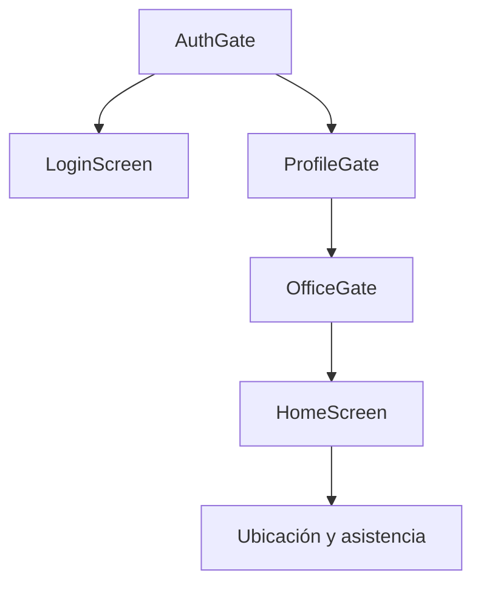
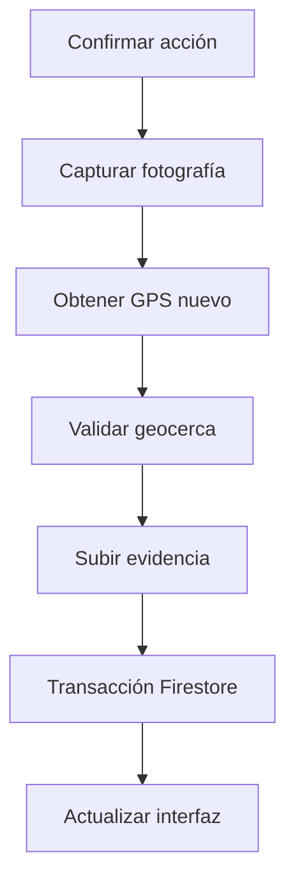

# Matriz pantalla–dato–consulta

## 1. Propósito

Esta matriz demuestra la trazabilidad entre:

- Pantallas visibles.
- Componentes Flutter.
- Datos mostrados o capturados.
- Repositorios utilizados.
- Consultas reales.
- Reglas de seguridad.
- Estados de error.

La finalidad es evitar asociar pantallas con operaciones genéricas que no existan en el código.

## 2. Flujo de navegación



No se permite llegar directamente a `HomeScreen`. Antes deben validarse:

1\. Sesión.

2\. Perfil.

3\. Estado del perfil.

4\. Sede asignada.

5\. Existencia y estado de la sede.

## 3. Matriz principal

| Pantalla o estado | Componente Flutter | Datos utilizados | Operación real | Fuente |
|---|---|---|---|---|
| Comprobación de sesión | `AuthGate` | Usuario autenticado | Escuchar cambios de sesión | Firebase Authentication |
| Inicio de sesión | `LoginScreen` | Correo y contraseña | `signInWithEmailAndPassword` | Firebase Authentication |
| Carga de perfil | `ProfileGate` | UID de Authentication | Observar `users/{uid}` | Cloud Firestore |
| Cuenta no autorizada | `ProfileGate` | Ausencia del documento | Resultado nulo del stream | Cloud Firestore |
| Cuenta pendiente/inactiva | `ProfileGate` | `status` | Evaluación local del perfil autorizado | Modelo `UserProfile` |
| Sin sede asignada | `ProfileGate` | `officeId` | Comprobación de valor nulo | Modelo `UserProfile` |
| Carga de sede | `OfficeGate` | `officeId` | Observar `offices/{officeId}` | Cloud Firestore |
| Sede inexistente/inactiva | `OfficeGate` | Documento y `active` | Evaluación del stream | Modelo `Office` |
| Inicio autorizado | `HomeScreen` | Perfil y sede | Composición de datos ya consultados | Memoria de la aplicación |
| Validación geográfica | `LocationVerificationCard` | GPS y configuración de sede | Obtener ubicación y calcular distancia | Geolocator y dominio |
| Jornada actual | `AttendanceRegistrationCard` | UID y fecha laboral | Leer `attendances/{uid}_{fecha}` | Cloud Firestore |
| Confirmación de marcación | `AlertDialog` | Tipo de evento | Confirmación local | Flutter |
| Captura fotográfica | `ImagePickerEvidenceCamera` | Imagen frontal | Capturar JPEG | Cámara del dispositivo |
| Subida de evidencia | `FirebaseEvidenceRepository` | Archivo y metadatos | Crear objeto en Storage | Cloud Storage |
| Registrar entrada | `AttendanceRegistrationService` | Usuario, sede, GPS y evidencia | Transacción de creación | Cloud Firestore |
| Registrar salida | `AttendanceRegistrationService` | Jornada abierta, GPS y evidencia | Transacción de actualización | Cloud Firestore |
| Jornada completada | `AttendanceRegistrationCard` | `status` y `checkOut` | Interpretación del documento diario | Modelo de dominio |
| Historial personal | `AttendanceHistoryScreen` | UID del trabajador | Filtro, orden y límite | Cloud Firestore |
| Cerrar sesión | AppBar/ProfileGate | Sesión actual | `signOut` | Firebase Authentication |

## 4. Pantalla de inicio de sesión

Archivo:

```text
lib/features/auth/presentation/login_screen.dart
```

### Entradas

| Control | Dato | Validación |
|---|---|---|
| `TextFormField` | Correo electrónico | Obligatorio y formato de correo |
| `TextFormField` | Contraseña | Obligatoria y mínimo 6 caracteres |
| `FilledButton` | Confirmación | Se deshabilita mientras procesa |

### Operación

```text
FirebaseAuth.signInWithEmailAndPassword(
  email: correo,
  password: contraseña
)
```

Esta operación no consulta directamente Firestore.

### Resultado

- Sesión válida: `AuthGate` recibe un usuario.
- Credenciales incorrectas: se muestra un `SnackBar`.
- Problema de red: se muestra un mensaje controlado.
- Mientras se procesa: aparece `Verificando...`.

### Seguridad

- La contraseña no se guarda en Firestore.
- El campo de contraseña permanece oculto.
- Firebase Authentication administra la sesión.
- Autenticarse no garantiza acceso; todavía se debe validar el perfil.

## 5. Comprobación de sesión

Archivo:

```text
lib/features/auth/presentation/auth_gate.dart
```

### Operación

```text
authRepository.authStateChanges()
```

### Componente

```text
StreamBuilder<User?>
```

### Decisiones

| Resultado | Navegación |
|---|---|
| Esperando | Indicador de carga |
| Error | Mensaje de error |
| Usuario nulo | `LoginScreen` |
| Usuario autenticado | `ProfileGate` |

## 6. Validación del perfil

Archivos:

```text
lib/features/users/presentation/profile_gate.dart
lib/features/users/data/firestore_user_repository.dart
```

### Consulta real

```text
users/{request.auth.uid}
```

Equivalente Flutter:

```text
FirebaseFirestore.instance
  .collection("users")
  .doc(uid)
  .snapshots()
```

### Campos consumidos

| Campo | Uso en pantalla |
|---|---|
| `uid` | Propiedad y consultas posteriores |
| `email` | Tarjeta de perfil |
| `fullName` | Encabezado |
| `employeeCode` | Código del trabajador |
| `role` | Etiqueta de rol |
| `status` | Permitir o bloquear acceso |
| `officeId` | Continuar hacia `OfficeGate` |

### Estados previstos

| Estado | Respuesta de la interfaz |
|---|---|
| Documento inexistente | Cuenta sin autorización |
| `pending` | Cuenta pendiente |
| `inactive` | Cuenta inactiva |
| `active` sin sede | Sin sede asignada |
| `active` con sede | Continuar a `OfficeGate` |
| `permission-denied` | Mensaje sin acceso |
| `unavailable` | Mensaje y botón para reintentar |

### Regla relacionada

El usuario solamente puede leer su propio perfil. Un administrador activo puede leer otros perfiles.

## 7. Validación de sede

Archivos:

```text
lib/features/offices/presentation/office_gate.dart
lib/features/offices/data/firestore_office_repository.dart
```

### Consulta real

```text
offices/{profile.officeId}
```

Equivalente Flutter:

```text
FirebaseFirestore.instance
  .collection("offices")
  .doc(officeId)
  .snapshots()
```

### Campos consumidos

| Campo | Uso |
|---|---|
| ID del documento | Identificador de sede |
| `name` | Nombre mostrado |
| `address` | Dirección |
| `location` | Centro de geocerca |
| `radiusMeters` | Radio autorizado |
| `maxAccuracyMeters` | Calidad GPS requerida |
| `timezone` | Fecha laboral |
| `active` | Permitir o bloquear acceso |

### Estados previstos

- Cargando sede.
- Error de conexión.
- Sede inexistente.
- Sede inactiva.
- Sede válida.

Un trabajador solamente puede consultar la sede asignada en su perfil.

## 8. Pantalla principal

Archivo:

```text
lib/features/home/presentation/home_screen.dart
```

`HomeScreen` no ejecuta una consulta adicional para perfil o sede. Recibe objetos ya validados por `ProfileGate` y `OfficeGate`.

### Datos de perfil mostrados

- Nombre completo.
- Código de trabajador.
- Correo.
- Rol.
- Estado.

### Datos de sede mostrados

- Nombre.
- Dirección.
- Radio permitido.
- Precisión máxima.

### Componentes funcionales

```text
LocationVerificationCard
AttendanceRegistrationCard
```

Esta composición evita repetir consultas innecesarias.

## 9. Validación geográfica informativa

Archivo:

```text
lib/features/location/presentation/location_verification_card.dart
```

### Origen de datos

| Dato | Origen |
|---|---|
| Latitud | Geolocator |
| Longitud | Geolocator |
| Precisión | Geolocator |
| Fecha de captura | Geolocator |
| Indicador simulado | Geolocator |
| Centro y límites | Objeto `Office` |

### Operación

```text
locationService.getCurrentLocation()
geofenceValidator.validate(office, location)
```

No existe una consulta Firestore adicional porque la sede ya fue cargada por `OfficeGate`.

### Resultados

- Ubicación permitida.
- Fuera del radio.
- Precisión insuficiente.
- GPS simulado.
- Sede inactiva.
- GPS desactivado.
- Permiso rechazado.
- Permiso bloqueado permanentemente.
- Tiempo de espera agotado.

Esta tarjeta es informativa y no registra asistencia. Cada marcación obtiene una ubicación nueva mediante el servicio de registro.

## 10. Consulta de la jornada actual

Archivos:

```text
lib/features/attendance/presentation/attendance_registration_card.dart
lib/features/attendance/data/firestore_attendance_repository.dart
```

### Documento

```text
attendances/{uid}_{YYYY-MM-DD}
```

### Operación real

```text
attendanceRepository.getForDay(
  userId: uid,
  workDay: fechaActualEnLima
)
```

Equivalente Firestore:

```text
attendances
  .doc(uid + "_" + workDate)
  .get()
```

No se realiza una consulta de colección para conocer la jornada actual. El ID determinista permite una lectura directa.

### Resultado de la consulta

| Resultado | Estado visual | Acción disponible |
|---|---|---|
| Documento inexistente | Entrada pendiente | Registrar entrada |
| `checked-in` | Salida pendiente | Registrar salida |
| `completed` | Jornada completada | Ninguna |
| Error | Mensaje controlado | Reintentar |

El componente utiliza:

```text
FutureBuilder<AttendanceRecord?>
```

## 11. Flujo completo de registro

Archivo coordinador:

```text
lib/features/attendance/application/attendance_registration_service.dart
```

El registro no está fragmentado en operaciones independientes del usuario. Un solo caso de uso coordina el proceso.



Si Firestore falla después de subir la fotografía, el servicio intenta eliminar la evidencia todavía no confirmada.

## 12. Registro de entrada

### Operaciones

1\. Consultar el documento diario.

2\. Confirmar que no existe.

3\. Capturar fotografía.

4\. Obtener ubicación.

5\. Validar geocerca.

6\. Crear evidencia `check-in.jpg`.

7\. Crear el documento mediante transacción.

8\. Leer el resultado desde el servidor.

### Escritura Firestore

```text
transaction.set(
  attendances/{uid}_{fecha},
  {
    status: "checked-in",
    checkIn: {...},
    checkOut: null
  }
)
```

### Control de duplicidad

Si el documento ya existe, se devuelve:

```text
duplicateCheckIn
```

## 13. Registro de salida

### Operaciones

1\. Consultar el documento diario.

2\. Confirmar que existe una entrada.

3\. Confirmar que no existe salida.

4\. Capturar una fotografía nueva.

5\. Obtener una ubicación nueva.

6\. Validar geocerca.

7\. Crear evidencia `check-out.jpg`.

8\. Actualizar el documento mediante transacción.

9\. Leer el resultado desde el servidor.

### Actualización Firestore

```text
transaction.update(
  attendances/{uid}_{fecha},
  {
    status: "completed",
    checkOut: {...},
    updatedAt: serverTimestamp
  }
)
```

No se permite modificar `checkIn`, `userId`, `officeId`, `workDate`, `createdAt` ni `schemaVersion`.

## 14. Operaciones de Storage

### Crear evidencia

Componente:

```text
FirebaseEvidenceRepository
```

Rutas:

```text
attendanceEvidence/{uid}/{attendanceId}/check-in.jpg
attendanceEvidence/{uid}/{attendanceId}/check-out.jpg
```

### Eliminar evidencia provisional

La eliminación no representa un CRUD libre. Solo compensa un fallo ocurrido antes de que Firestore confirme la marcación.

Una evidencia confirmada no puede:

- Sobrescribirse.
- Modificarse.
- Eliminarse.

## 15. Consulta de historial

Contrato implementado:

```text
attendanceRepository.watchHistory(
  userId: uid,
  limit: 30
)
```

Consulta real:

```text
attendances
  .where("userId", isEqualTo: uid)
  .orderBy("workDate", descending: true)
  .limit(30)
```

Índice relacionado:

```text
userId ASC
workDate DESC
```

Las reglas exigen:

- Usuario activo.
- Propiedad de los documentos.
- Límite no nulo.
- Límite máximo de 50.

El repositorio, las reglas y la pantalla visual del historial están implementados e integrados en el flujo principal del MVP.

## 16. Matriz de operaciones

| Operación | Método | Documento o servicio | Componente consumidor |
|---|---|---|---|
| Observar sesión | `authStateChanges` | Authentication | `AuthGate` |
| Iniciar sesión | `signIn` | Authentication | `LoginScreen` |
| Cerrar sesión | `signOut` | Authentication | AppBar y puertas de acceso |
| Observar perfil | `watchProfile` | `users/{uid}` | `ProfileGate` |
| Observar sede | `watchOffice` | `offices/{officeId}` | `OfficeGate` |
| Obtener jornada | `getForDay` | `attendances/{uid}_{fecha}` | `AttendanceRegistrationCard` |
| Consultar historial | `watchHistory` | Consulta `attendances` | `AttendanceHistoryScreen` |
| Capturar evidencia | `capture` | Cámara frontal | Servicio de registro |
| Subir evidencia | `upload` | Cloud Storage | Servicio de registro |
| Eliminar provisional | `delete` | Cloud Storage | Compensación de error |
| Registrar entrada | `registerCheckIn` | Transacción Firestore | Servicio de registro |
| Registrar salida | `registerCheckOut` | Transacción Firestore | Servicio de registro |

## 17. Manejo de errores por componente

| Componente | Errores controlados |
|---|---|
| `LoginScreen` | Credenciales, formato y conexión |
| `ProfileGate` | Sin perfil, pendiente, inactivo y permisos |
| `OfficeGate` | Sin sede, sede inexistente, inactiva y conexión |
| `LocationVerificationCard` | Permisos, GPS, precisión, distancia y simulación |
| `AttendanceRegistrationCard` | Duplicado, salida inválida, permisos y red |
| `AttendanceRegistrationService` | Cámara cancelada, evidencia, GPS y compensación |
| Repositorios | Datos incompatibles y errores Firebase |

## 18. Trazabilidad de la matriz

| Pantalla | Archivo principal |
|---|---|
| Sesión | `lib/features/auth/presentation/auth_gate.dart` |
| Inicio de sesión | `lib/features/auth/presentation/login_screen.dart` |
| Acceso por perfil | `lib/features/users/presentation/profile_gate.dart` |
| Acceso por sede | `lib/features/offices/presentation/office_gate.dart` |
| Inicio | `lib/features/home/presentation/home_screen.dart` |
| Ubicación | `lib/features/location/presentation/location_verification_card.dart` |
| Asistencia | `lib/features/attendance/presentation/attendance_registration_card.dart` |

## 19. Conclusión

Cada pantalla se encuentra vinculada a un componente y una operación concreta. El registro de asistencia se ejecuta como un caso de uso coordinado y no como escrituras manuales independientes.

La estructura permite auditar:

- Qué dato se muestra.
- De dónde proviene.
- Qué consulta lo obtiene.
- Qué componente lo consume.
- Qué regla protege la operación.
- Qué ocurre cuando la operación falla.
