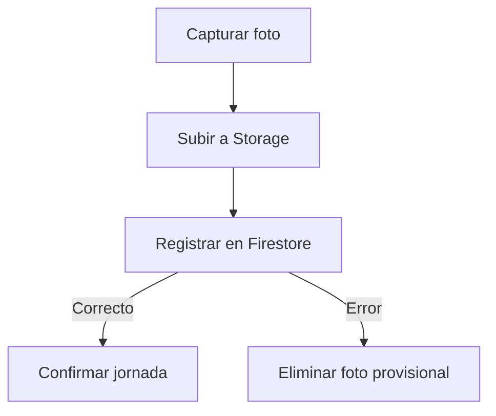

# Consultas, CRUD, pruebas, implementación y defensa

## 1. Objetivo

Este documento presenta evidencia verificable de:

- Consultas utilizadas por el MVP.
- Operaciones de creación, lectura y actualización.
- Prevención de duplicidad.
- Transacciones.
- Manejo de errores.
- Consistencia entre Firestore y Storage.
- Pruebas automatizadas.
- Prueba manual de extremo a extremo.
- Decisiones que deben explicarse durante la defensa.

## 2. Consultas del MVP

### 2.1. Consulta de perfil

```text
users/{uid}
```

Implementación:

```text
FirebaseFirestore.instance
  .collection("users")
  .doc(uid)
  .snapshots()
```

Características:

- Lectura directa.
- Actualización en tiempo real.
- Solo el propietario o un administrador puede leer.
- Devuelve `null` cuando el perfil no existe.
- El repositorio valida campos, tipos, UID y versión.

### 2.2. Consulta de sede

```text
offices/{officeId}
```

Implementación:

```text
FirebaseFirestore.instance
  .collection("offices")
  .doc(officeId)
  .snapshots()
```

Características:

- Lectura directa.
- El trabajador solo puede leer la sede asignada.
- El administrador puede leer cualquier sede.
- El repositorio valida ubicación, radio, precisión y zona horaria.

### 2.3. Consulta de jornada diaria

```text
attendances/{uid}_{YYYY-MM-DD}
```

Implementación:

```text
attendanceRepository.getForDay(
  userId: uid,
  workDay: AttendanceDay
)
```

Características:

- No recorre la colección.
- Utiliza un ID determinista.
- Puede consultar el documento propio aunque todavía no exista.
- Permite decidir si corresponde entrada, salida o jornada completada.

### 2.4. Consulta de historial

```text
attendances
  .where("userId", isEqualTo: uid)
  .orderBy("workDate", descending: true)
  .limit(30)
```

Características:

- Filtra por propietario.
- Ordena desde la fecha más reciente.
- Limita el consumo de lecturas.
- El repositorio admite límites entre 1 y 50.
- Las reglas rechazan consultas sin límite.
- Requiere el índice `userId ASC, workDate DESC`.

### 2.5. Consulta administrativa implementada

```text
attendances
  .orderBy("workDate", descending: true)
  .limit(50)
```

`AdminAttendancesScreen` consume esta consulta, relaciona cada registro con el
trabajador y la sede, y permite buscar por nombre, código, sede, estado o fecha.
El detalle abre las evidencias protegidas de entrada y salida.

## 3. Operaciones CRUD

## 3.1. Usuarios

| Operación | Disponibilidad | Responsable |
|---|---|---|
| Crear | Permitida | Administrador activo |
| Leer uno | Permitida | Propietario o administrador |
| Listar | Permitida | Administrador activo |
| Actualizar | Permitida | Administrador activo |
| Eliminar | Rechazada | Nadie |

Los perfiles se desactivan cambiando `status`; no se eliminan para conservar trazabilidad.

## 3.2. Sedes

| Operación | Disponibilidad | Responsable |
|---|---|---|
| Crear | Permitida | Administrador activo |
| Leer una | Permitida | Usuario asignado o administrador |
| Listar | Permitida | Administrador activo |
| Actualizar | Permitida | Administrador activo |
| Eliminar | Rechazada | Nadie |

Una sede se retira de operación mediante `active: false`.

## 3.3. Asistencias

| Operación | Disponibilidad | Uso |
|---|---|---|
| Crear | Permitida | Registrar entrada |
| Leer una | Permitida | Consultar jornada |
| Listar | Permitida con límite | Consultar historial |
| Actualizar | Permitida | Registrar salida |
| Eliminar | Rechazada | Proteger auditoría |

La ausencia de eliminación es una regla del negocio y no una implementación incompleta.

## 3.4. Evidencias

| Operación | Disponibilidad | Uso |
|---|---|---|
| Crear | Permitida | Entrada o salida válida |
| Leer una | Permitida | Propietario o administrador |
| Listar | Rechazada | Evitar enumeración de archivos |
| Actualizar | Rechazada | Evidencia inmutable |
| Eliminar | Condicionada | Compensar una marcación no confirmada |

## 4. Registro transaccional de entrada

La entrada utiliza una transacción:

```text
1. Leer attendances/{uid}_{fecha}.
2. Rechazar si ya existe.
3. Crear el documento con status = checked-in.
4. Establecer checkOut = null.
5. Usar timestamps del servidor.
6. Confirmar la transacción.
```

Pseudocódigo:

```text
runTransaction {
  snapshot = get(documentoDiario)
  if snapshot.exists:
    throw duplicateCheckIn
  set(documentoDiario, datosDeEntrada)
}
```

La existencia del documento y la creación se evalúan como una operación atómica.

## 5. Registro transaccional de salida

```text
1. Leer attendances/{uid}_{fecha}.
2. Rechazar si no existe.
3. Rechazar si checkOut ya existe.
4. Verificar status = checked-in.
5. Mantener inmutable la entrada.
6. Actualizar status = completed.
7. Añadir checkOut.
8. Actualizar updatedAt con hora del servidor.
```

Pseudocódigo:

```text
runTransaction {
  snapshot = get(documentoDiario)
  if !snapshot.exists:
    throw missingCheckIn
  if snapshot.status == completed:
    throw alreadyCheckedOut
  update(documentoDiario, {
    status: completed,
    checkOut: nuevaMarcacion,
    updatedAt: serverTimestamp
  })
}
```

## 6. Prevención de duplicidad

Se aplican varias barreras:

| Barrera | Función |
|---|---|
| ID determinista | Una ruta por usuario y día |
| Transacción | Lectura y escritura atómicas |
| Validación del repositorio | Rechaza documento existente |
| Reglas Firestore | Solo permite crear una entrada válida |
| Estado de jornada | Impide una segunda salida |
| Evidencia inmutable | Impide reemplazar fotografías |
| Interfaz | Deshabilita el botón mientras registra |

La duplicidad no depende únicamente de que el botón esté deshabilitado.

## 7. Consistencia entre Storage y Firestore

La marcación utiliza dos servicios diferentes y no existe una transacción distribuida entre ambos.

Por eso se aplica una estrategia de compensación:



Si Firestore falla:

- La aplicación intenta eliminar la fotografía.
- Storage permite eliminarla solamente mientras no esté confirmada.
- Una evidencia vinculada a una asistencia confirmada no puede eliminarse.

Esta estrategia evita, en la mayoría de casos controlados, archivos huérfanos.

## 8. Manejo de errores

### 8.1. Authentication

- Credenciales inválidas.
- Cuenta deshabilitada.
- Demasiados intentos.
- Error de red.
- Error desconocido.

### 8.2. Perfiles y sedes

- Documento inexistente.
- Permiso denegado.
- Firestore no disponible.
- Tipo de campo incorrecto.
- Versión incompatible.
- Perfil inactivo o pendiente.
- Sede inexistente o inactiva.

### 8.3. Ubicación

- GPS desactivado.
- Permiso rechazado.
- Permiso bloqueado permanentemente.
- Ubicación precisa desactivada.
- Tiempo de espera.
- Precisión insuficiente.
- Fuera del radio.
- Ubicación simulada.

### 8.4. Evidencia

- Cámara cancelada.
- Archivo vacío.
- Formato diferente de JPEG.
- Tamaño mayor de 2 MB.
- Ruta incorrecta.
- Error de carga.
- Permiso denegado.
- Error de limpieza provisional.

### 8.5. Asistencia

Los códigos de dominio incluyen:

```text
duplicateCheckIn
missingCheckIn
alreadyCheckedOut
locationNotAllowed
evidenceRequired
permissionDenied
unavailable
invalidData
```

Cada error se transforma en un mensaje comprensible para el usuario.

## 9. Estrategia de pruebas

| Nivel | Herramienta | Finalidad |
|---|---|---|
| Análisis estático | `flutter analyze` | Detectar problemas de tipos y estilo |
| Pruebas unitarias | `flutter_test` | Validar dominio y casos de uso |
| Pruebas de widgets | `flutter_test` | Validar estados visibles |
| Repositorios | `fake_cloud_firestore` | Validar transacciones y lectura |
| Reglas Firestore | Emulator Suite | Validar acceso e integridad |
| Reglas Storage | Emulator Suite | Validar evidencias |
| Prueba manual | Emulador Android | Validar flujo completo |
| Validación iOS | GitHub Actions, macOS 26 y simulador iPhone | Validar compilación, instalación y arranque |

## 10. Pruebas Flutter

Resultado verificado:

```text
35 pruebas aprobadas
```

### 10.1. Distribución

| Archivo | Cantidad | Cobertura |
|---|---:|---|
| `test/widget_test.dart` | 1 | Formulario sin sesión |
| `geofence_validator_test.dart` | 5 | Radio, precisión y GPS simulado |
| `location_verification_card_test.dart` | 2 | Estados permitido y rechazado |
| `attendance_day_test.dart` | 4 | Zona horaria, cambio de día e ID |
| `firestore_attendance_repository_test.dart` | 4 | Entrada, salida y duplicidad |
| `attendance_evidence_test.dart` | 7 | Ruta, JPEG, tamaño y UID |
| `attendance_registration_service_test.dart` | 7 | Coordinación y compensación |
| `attendance_history_screen_test.dart` | 4 | Historial, estados y errores |
| `admin_dashboard_screen_test.dart` | 1 | Navegación administrativa |
| **Total** | **35** | |

### 10.2. Casos de geocerca

- Acepta una ubicación precisa dentro de la sede.
- Rechaza una ubicación fuera del radio.
- Rechaza una precisión mayor de 30 metros.
- Rechaza una ubicación simulada en producción.
- Solo permite simulación cuando se configura explícitamente para desarrollo.

### 10.3. Fecha laboral

- Antes de medianoche en Lima pertenece al día anterior correspondiente.
- Exactamente a medianoche cambia la jornada.
- Construye un ID determinista.
- Rechaza fechas inexistentes.

### 10.4. Repositorio de asistencia

- Registra entrada.
- Rechaza entrada duplicada.
- Rechaza salida sin entrada.
- Completa la jornada.
- Rechaza salida duplicada.

### 10.5. Evidencia

- Construye ruta de entrada.
- Construye ruta de salida.
- Acepta JPEG válido.
- Rechaza archivo vacío.
- Rechaza formato incorrecto.
- Rechaza archivo mayor de 2 MB.
- Rechaza UID con `/`.

### 10.6. Servicio coordinador

- Registra entrada.
- Registra salida.
- Cancela si el usuario cierra la cámara.
- Rechaza GPS fuera del radio.
- Elimina la foto si Firestore falla.
- Impide registrar después de completar la jornada.
- Reutiliza correctamente una fotografía recuperada.

### 10.7. Pantalla de historial

- Muestra un estado vacío sin asistencias.
- Muestra una jornada con salida pendiente.
- Muestra entrada y salida de una jornada completada.
- Muestra errores del repositorio y la acción de reintento.

### 10.8. Panel administrativo

- Muestra el resumen operativo.
- Permite navegar hacia personal, sedes y asistencias.
- Relaciona trabajadores, sedes y jornadas visibles.

## 11. Pruebas de reglas Firestore

Resultado:

```text
33 pruebas aprobadas
```

Casos:

1. Rechaza usuario no autenticado.

2. Rechaza trabajador inactivo.

3. Permite entrada válida.

4. Rechaza sede no asignada.

5. Rechaza GPS simulado.

6. Rechaza precisión insuficiente.

7. Rechaza coordenadas lejanas con distancia declarada cero.

8. Rechaza distancia que no coincide con las coordenadas.

9. Rechaza ruta de evidencia incorrecta.

10. Rechaza entrada duplicada.

11. Rechaza salida sin entrada previa.

12. Permite salida válida.

13. Impide modificar la entrada al registrar salida.

14. Rechaza una segunda salida.

15. Impide eliminar una asistencia.

16. Permite al propietario leer su asistencia.

17. Impide que otro trabajador lea la asistencia.

18. Permite lectura al administrador activo.

19. Permite historial propio con filtro y límite.

20. Rechaza historial sin límite.

21. Permite consultar el documento diario propio aunque no exista.

22. Impide consultar un documento inexistente ajeno.

23. Permite al administrador listar perfiles.

24. Impide al trabajador listar perfiles.

25. Permite al administrador crear un perfil válido.

26. Impide al trabajador crear perfiles.

27. Permite al administrador actualizar un trabajador.

28. Impide que el administrador cambie su propio rol.

29. Permite al administrador crear una sede válida.

30. Permite al administrador actualizar una sede.

31. Impide al trabajador crear una sede.

32. Impide eliminar perfiles y sedes.

33. Impide asignar una sede inexistente a un trabajador activo.

## 12. Pruebas de reglas Storage

Resultado:

```text
20 pruebas aprobadas
```

Casos:

1. Rechaza carga sin autenticación.

2. Rechaza trabajador inactivo.

3. Permite JPEG válido del propietario.

4. Rechaza carga en ruta ajena.

5. Rechaza contenido diferente de JPEG.

6. Rechaza evidencia mayor de 2 MB.

7. Rechaza evidencia vacía.

8. Rechaza sede incorrecta.

9. Rechaza nombre no autorizado.

10. Impide sobrescribir una fotografía.

11. Permite lectura al propietario.

12. Impide lectura a otro trabajador.

13. Permite lectura al administrador.

14. Impide modificar metadatos.

15. Permite limpiar entrada no confirmada.

16. Impide eliminar entrada confirmada.

17. Rechaza salida sin entrada abierta.

18. Permite salida con entrada abierta.

19. Permite limpiar salida no confirmada.

20. Impide eliminar salida confirmada.

## 13. Resultado total de reglas

```text
33 pruebas Firestore
20 pruebas Storage
53 pruebas de reglas aprobadas
```

Comando reproducible:

```powershell
firebase emulators:exec `
  --only "firestore,storage" `
  "npm --prefix firebase-tests test" `
  --project control-asistencia-d468b
```

Resultado esperado:

```text
53 passing
Script exited successfully (code 0)
```

## 14. Validación de calidad Flutter

```powershell
dart format lib test
flutter analyze
flutter test
```

Resultados esperados:

```text
No issues found!
All tests passed!
```

El mensaje aislado `Acceso denegado.` que aparece antes de algunos comandos corresponde al entorno local de PowerShell. El proceso Flutter finaliza correctamente con código de salida cero.

## 15. Prueba manual de extremo a extremo

Fecha de prueba:

```text
30/07/2026
```

Entorno:

- Android Emulator.
- Authentication Emulator.
- Firestore Emulator.
- Storage Emulator.
- Sede UNH Pampas.
- Ubicación simulada desde el emulador.

### Procedimiento

1. Iniciar los emuladores.

2. Ejecutar el script `seed-demo.js`.

3. Iniciar la aplicación con `USE_FIREBASE_EMULATORS=true`.

4. Iniciar sesión con el usuario local.

5. Comprobar perfil y sede.

6. Simular las coordenadas de UNH Pampas.

7. Validar ubicación.

8. Registrar entrada.

9. Confirmar documento en Firestore.

10. Confirmar `check-in.jpg` en Storage.

11. Registrar salida.

12. Confirmar `status: completed`.

13. Confirmar mapa `checkOut`.

14. Confirmar `check-out.jpg`.

### Resultado obtenido

- Inicio de sesión correcto.
- Perfil activo cargado.
- Sede UNH Pampas cargada.
- Distancia aproximada: 0.1 metros.
- Precisión aproximada: 5 metros.
- Mensaje `UBICACIÓN PERMITIDA`.
- Entrada almacenada con `status: checked-in`.
- Evidencia `check-in.jpg` almacenada.
- Salida registrada.
- Jornada mostrada como completada.
- Entrada y salida conservadas en un solo documento.
- Evidencia `check-out.jpg` almacenada.

## 16. Evidencias que deben conservarse

Las capturas deberán almacenarse posteriormente en:

```text
docs/evidencias/
```

| Archivo propuesto | Evidencia |
|---|---|
| `01-login.png` | Pantalla de inicio de sesión |
| `02-perfil-sede.png` | Perfil y sede autorizados |
| `03-ubicacion-permitida.png` | Distancia y precisión |
| `04-entrada-registrada.png` | Estado de entrada |
| `05-firestore-entrada.png` | Documento `checked-in` |
| `06-storage-entrada.png` | `check-in.jpg` |
| `07-jornada-completada.png` | Estado final en la app |
| `08-firestore-salida.png` | Documento `completed` |
| `09-storage-salida.png` | `check-out.jpg` |
| `10-pruebas-flutter.png` | Resultado de `flutter test` |
| `11-pruebas-reglas.png` | Resultado `42 passing` |

Las capturas no deben mostrar contraseñas, tokens, claves privadas ni información personal innecesaria.

## 17. Guion breve para la defensa

### ¿Qué problema resuelve?

Evita registrar una asistencia únicamente con una hora ingresada manualmente. Vincula la jornada con usuario, sede, GPS, fotografía y hora del servidor.

### ¿Por qué Firestore?

Porque se integra con Flutter y Authentication, ofrece streams, transacciones, reglas de seguridad e infraestructura administrada adecuada para el MVP.

### ¿Por qué no SQLite?

SQLite serviría para almacenamiento local, pero no proporcionaría una fuente institucional central ni reglas remotas por usuario.

### ¿Cómo se evita una entrada duplicada?

Mediante un ID formado por UID y fecha, una transacción, validación del repositorio y reglas de Firestore.

### ¿Puede el cliente declarar distancia cero desde otro lugar?

No debe ser aceptado. Firestore recalcula la distancia entre el GPS recibido y la sede, y compara ambos resultados con una tolerancia de 2 metros.

### ¿Por qué se guarda la fotografía en Storage?

Porque Firestore está diseñado para documentos estructurados. Storage está diseñado para archivos binarios y permite reglas sobre ruta, tamaño, tipo y metadatos.

### ¿Qué sucede si se sube la fotografía pero Firestore falla?

El servicio ejecuta una eliminación compensatoria. Las reglas solo permiten borrar la evidencia mientras todavía no esté confirmada.

### ¿Por qué la asistencia no funciona sin conexión?

La operación necesita una transacción, hora del servidor, reglas remotas y subida de evidencia. Confirmarla localmente podría presentar como válida una marcación que nunca llegó al servidor.

### ¿Por qué no se eliminan asistencias?

Porque son registros de auditoría. Una eliminación destruiría la trazabilidad de la jornada.

### ¿Qué limitaciones existen?

- Storage remoto puede requerir Blaze.
- No existe reconocimiento facial.
- El panel administrativo es móvil; no se incluye un portal web independiente.
- No se admiten múltiples turnos.
- La detección de GPS simulado puede reforzarse con Play Integrity.
- Se necesita definir una política institucional de retención.

## 18. Criterios de aceptación del MVP

El MVP se considera correcto cuando:

- Solo accede un usuario autenticado y activo.
- El perfil tiene una sede válida.
- La sede está activa.
- La ubicación está dentro del radio.
- La precisión es aceptable.
- El GPS no está simulado.
- La evidencia es JPEG y no supera 2 MB.
- Solo existe una entrada diaria.
- La salida requiere entrada.
- La entrada no cambia al registrar salida.
- La jornada completada no vuelve a modificarse.
- Las evidencias confirmadas son inmutables.
- Otro trabajador no puede consultar los datos.
- El administrador puede gestionar perfiles y sedes sin eliminar auditoría.
- El administrador puede consultar asistencias y evidencias.
- Las pruebas Flutter y Firebase finalizan correctamente.

## 19. Archivos verificables

| Evidencia | Ruta |
|---|---|
| Reglas Firestore | `firestore.rules` |
| Índices | `firestore.indexes.json` |
| Reglas Storage | `storage.rules` |
| Pruebas Firestore | `firebase-tests/test/firestore.rules.test.js` |
| Pruebas Storage | `firebase-tests/test/storage.rules.test.js` |
| Datos locales | `firebase-tests/scripts/seed-demo.js` |
| Pruebas Flutter | `test/` |
| Configuración de emuladores | `firebase.json` |
| Código principal | `lib/` |

## 20. Conclusión

La implementación no se limita a mostrar consultas de ejemplo. Las operaciones están vinculadas con repositorios, componentes, reglas y pruebas ejecutables.

La combinación de:

- IDs deterministas.
- Transacciones.
- Validación geográfica.
- Evidencia inmutable.
- Reglas restrictivas.
- Manejo de errores.
- Pruebas automatizadas.
- Entorno reproducible.

permite demostrar la integridad del MVP y defender técnicamente sus decisiones.
